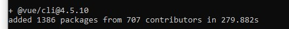
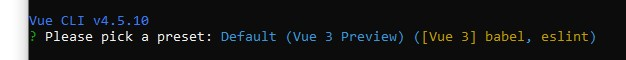
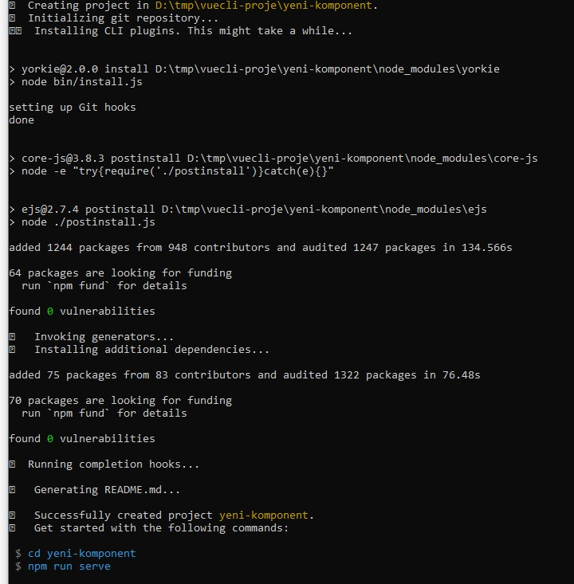
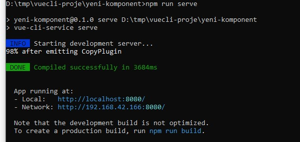
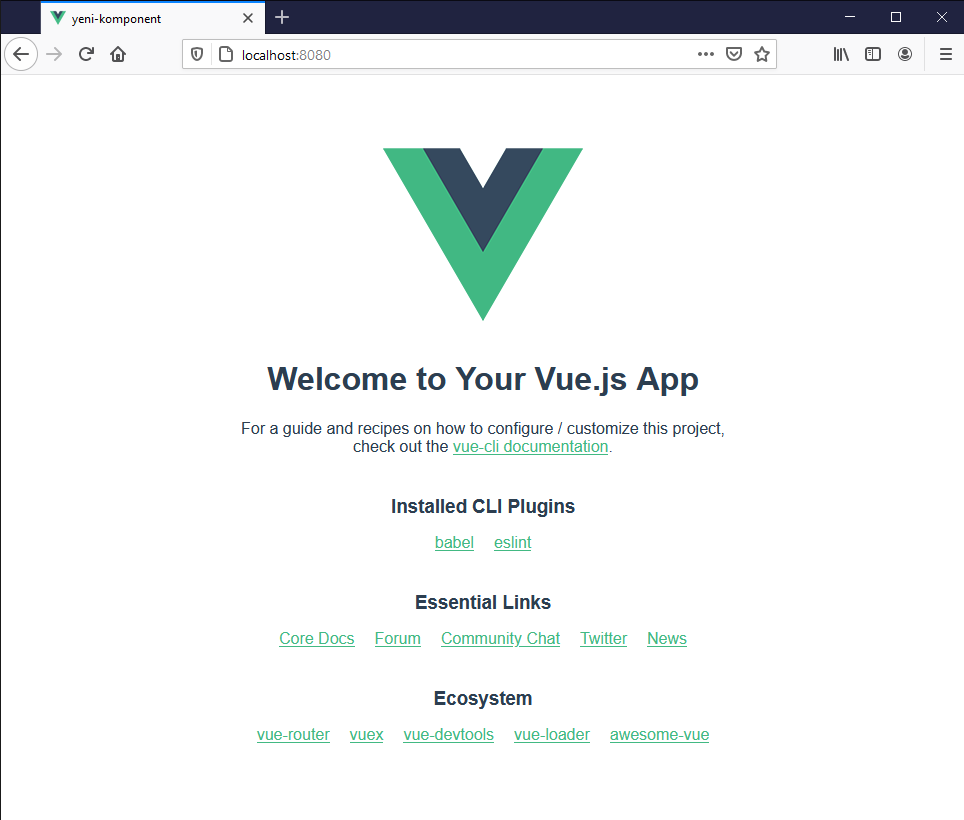
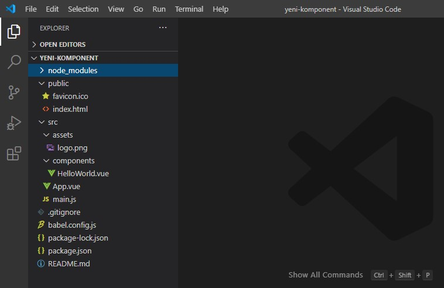

Vue.js, tasarım işini kolaylaştıran bir framework. Özellikle *model binding* yapıyor olması kodlama yükünü oldukça azaltıyor. Bu framework'ün en iyi taraflarından biri de tekrar kullanılabilir komponentler yapıp kullanmaya izin vermesi.
Bu yazımda bir komponent tasarlayacağız ve bu komponenti browser ile kullanılabilecek şekilde paketleyeceğiz. Bunun için [Vue.Cli](https://github.com/vuejs/vue-cli/) kullanacağız.
Hadi başlayalım.

## Hazırlık

Bu işi yapabilmek için ben aşağıda belirttiğim araçları kullandım. Önce ilgili olan araçların kurulumunu anlatacağım:

## Araçlar
* **Visual Studio Code**
  * Visual Studio Code uygulamasını bir editör olarak kullanacağız. Arzu ederseniz **Sublime Text**, **Atom** gibi diğer uygulamaları da kullanabilirsiniz. Ya da hangi editörü tercih ederseniz. [Visual Studio Code](https://code.visualstudio.com/) sitesinden edinebilirsiniz.
* **Node.js**
  * Node.js işimizin çekirdeğini oluşturan araçtır. [Node.js](https://nodejs.org/tr/) sitesinden edinebilirsiniz.
* **Vue.Cli**
  * Bu paket ile vue.js projeleri tasarlayıp kodlayabilirsiniz. Vue.js kodlama işini oldukça kolaylaştıran bir araç. Vue.js 3 versiyonunu kullanacağız. Arzu edenler [Vue.js 3](https://v3.vuejs.org/) sitesine göz atabilirler. 

## Kurulum

### Vue.Cli

Node.js uygulamasını Windows 10 bilgisayarımıza kurduğumuzda **Node.js Command Prompt** kısayolunu da yükler. Bu kısayol, Node.js ortam değişkenleri hazır olarak tanımlanmış bir kabuk (Shell) sunar. Kısayolu çalıştırarak **npm** paket yöneticisini kullanabiliriz. Paket yöneticisi ile **Vue.Cli** paketini sisteme yükleyeceğiz. Bunun için aşağıdaki komutu yazarız:

```npm install -g @vue/cli```

Bu komutu çalıştırdığımızda sistemimize **Vue.Cli** paketi yüklenecektir. Bu işlem internet bağlantısı hızına göre biraz zaman alabilir.



Bu resimdeki gibi bir sonuç gördüğünüzde **Vue.Cli** yüklenmiş demektir.

Şimdi **Vue.Cli** kullanarak yeni bir proje oluşturacağız. Yeni oluşturacağımız projede örnek bir vue app ve bir komponent yer alacak. Bunu bir *hello world* kodu gibi düşünebiliriz. Şu komutu veririz:

```vue create yeni-komponent```

Komutu verdikten sonra araç bizden hangi vue versiyonunu kullanacağımızı soracak. Burada vue 3 seçiyoruz.



Version seçimi yaptıktan sonra araç bağımlılıkları ve diğer paketler **Vue.Cli** tarafından yüklenir ve örnek kod olutşturulur. Burada işlem bitene kadar beklemek gerekli.



Yükleme tamamlandıktan sonra yukarıdaki resimdeki gibi bir çıktı göreceğiz. Bu aşamada artık kodların bulunduğu dizine gidip projeyi çalıştırmamız yeterli olacak. Şu komutları veririz:

```cd yeni-komponent```

Projeyi bu haliyle çalıştırabiliriz. Çalıştırmak için:

```npm run serve```

Komutun çıktısı şu şekilde olacaktır:



**serve** komutu projemizi yerel bir sunucuda sunmaya başlar fakat browser açarak sayfayı bize göstermez. Bunun için çıktı ekranındaki adreslerden birini kopyalayıp browser penceresine yapıştırarak sonucu görürüz.



**serve** komutu aktifken, yani sunucu çalışıyorken dosyalar üzerinde değişiklik yapabilir, sonucunu da direkt olarak browser penceresinde görebiliriz. Projemiz üzerinde çalışmak için **Visual Studio Code** uygulamasını kullanabiliriz. **Visual Studio Code** uygulamasını açtıktan sonra **Open Folder** *(Klasör Aç)* seçeneğini seçip projemizin içinde olduğu klasörü açarız. Soldaki dosya menüsünü genişlettiğimizde şöyle bir görüntü görürüz:



